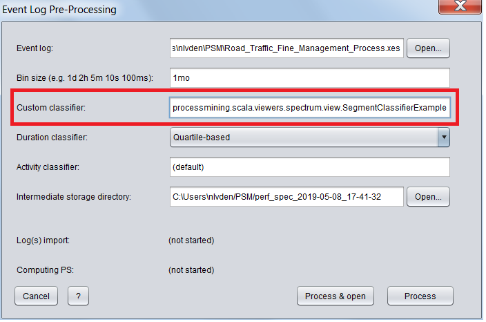

# Adding a Custom Segment Classifier

The PSM allows to use other classifiers besides the quartile-based and median-proportional.
That can be done by injecting a jar file with the custom classifier inplementation into [Java classpath](https://docs.oracle.com/javase/tutorial/essential/environment/paths.html).

## Guide

1. Create a new Java or Scala project
1. Add the PSM jar as a dependency
1. Implement your own classifier by extending `org.processmining.scala.log.common.enhancment.segments.common.AbstractDurationClassifier`
1. Build a jar file
1. Add the jar file to the PSM class path
1. Run the PSM
1. Provide the [fully qualified class name](https://docs.oracle.com/javase/tutorial/java/package/namingpkgs.html) of your custom classifier in the pre-processing dialog

## Example (for Java)

1. Extend your class with `AbstractDurationClassifier`: `public class SegmentClassifierExample extends AbstractDurationClassifier `
1. Define a constructor as follows: `public SegmentClassifierExample(final String path)`. `path` is a full path to the event log file or file description, or an empty string in case of running in ProM mode.
1. Implement method `classify`, which provides segment attributes and segment descriptove statistics as arguments
1. Implement `legend` to return a legend with the classifier name and class names separated by `%`, e.g. `"Example%Class_0%Class_1"`
1. Specify class number in `classCount`

A working example can be found here: `org.processmining.scala.viewers.spectrum.view.SegmentClassifierExample`.

